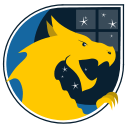
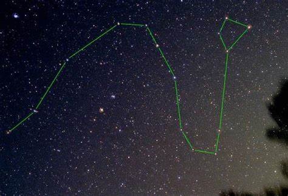

# Draco documation

## What is it?
Draco is highly-extensible set of open source services making it easy to deploy, serve, and manage trusted first and third-party application extensions, securely and at scale, anywhere.

## Getting started
TBD..

## Table of contents
TBD..

## The constellation

[Draco is a constellation](https://en.wikipedia.org/wiki/Draco_(constellation)) in the far northern sky. Its name is Latin for dragon. It was one of the 48 constellations listed by the 2nd century astronomer Ptolemy, and remains one of the 88 modern constellations today. The north pole of the ecliptic is in Draco. Draco is circumpolar (that is, never setting), and can be seen all year from northern latitudes. Rastaban derives from the Arabic for �the head of the serpent�. Other notable stars in Dracos includes the blue giants Aldhibah and Kappa Draconis; the white giant Thuban; the yellow giant Altais; the orange giant stars Ed Asich, Grumium and Upsilon Draconis; and the red giant Gianfar.